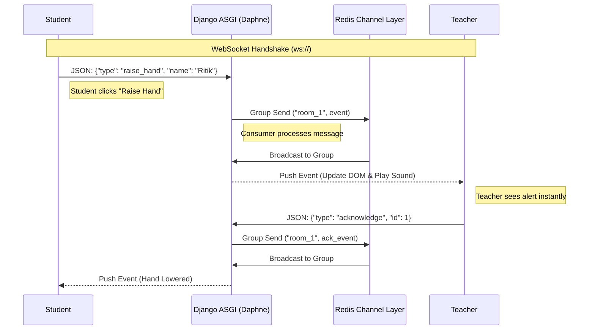

# RaiseHands

Project README
**RaiseHands**

A minimal Django + Channels application that provides a realtime "raise hand" classroom feature so teachers and students can interact during live sessions.

**Features**

- Realtime raise-hand notifications using Django Channels and WebSockets.

- Separate teacher and student views.

- Simple routing and consumer structure for easy extension.

 
# RaiseHand Lite

 

A minimal Django + Channels example that demonstrates realtime "raise hand" notifications for classrooms using WebSockets and an ASGI server.

## Overview

- Real-time raise-hand notifications via Django Channels and WebSockets.
- Separate teacher and student views with simple consumer and routing structure.

## Quickstart (local)

1. Create and activate a virtual environment.

Windows (PowerShell):

```powershell
python -m venv .venv
.\.venv\Scripts\Activate.ps1
pip install -r requirements.txt
```

macOS / Linux (bash):

```bash
python3 -m venv .venv
source .venv/bin/activate
pip install -r requirements.txt
```

2. Apply migrations and (optionally) create a superuser:

```bash
python manage.py migrate
python manage.py createsuperuser
```

3. Run the development ASGI server (Django's `runserver` supports ASGI via `asgi.py`):

```bash
python manage.py runserver
```

Open `http://127.0.0.1:8000/` in your browser.

## Using Docker (optional)

Start app + Redis via Docker Compose:

```bash
docker-compose up --build
```

Ensure your `raisehand_project/settings.py` CHANNEL_LAYERS is configured to use Redis when running with Docker.

## Architecture & Data Flow

This app uses ASGI and Channels to maintain persistent WebSocket connections between clients and the server. The flow is:



## Repository Layout

```
raisehand-lite/
├── raisehand_project/      # Project config (asgi.py, settings, urls)
├── classroom/              # App: consumers, routing, views, templates
├── manage.py
├── requirements.txt
└── docker-compose.yml      # Redis (optional)
```

## Notes for Production

- Use Redis for `CHANNEL_LAYERS` in production and run an ASGI server such as Daphne or Uvicorn.
- Collect static files and serve them with a proper static server or WhiteNoise.

## Where to look in the code

- WebSocket consumers: `classroom/consumers.py`
- WebSocket routing: `classroom/routing.py` and `raisehand_project/asgi.py`
- Templates: `classroom/templates/classroom/`

---

If you'd like, I can also: wire Redis into `docker-compose.yml`, add a `Procfile` for deployment, or run the project locally and verify WebSocket events—tell me which next.
This project is provided as-is; add an appropriate LICENSE file if you plan to reuse or distribute it.
